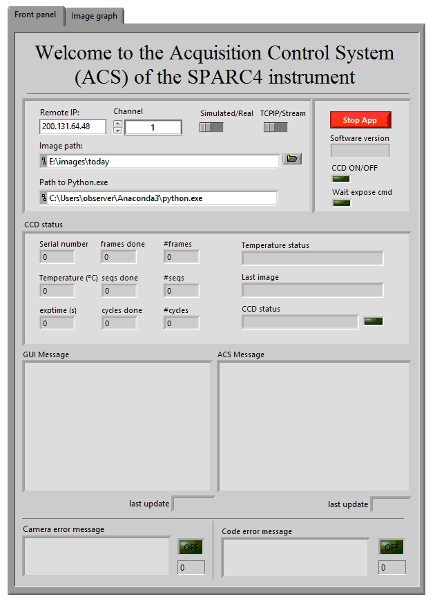

 # SPARC4 Acquisition Control System

*Instituto Nacional de Pesquisas Espaciais* (INPE), in collaboration with *Laboratório Nacional de Astrofísica* (LNA), is developing the Simultaneous Polarimeter and Rapid Camera in Four Bands ([SPARC4](https://coast.lna.br/home/sparc4)), a new astronomical instrument installed in the Perkin-Elmer 1.6 m telescope of Picos dos Dias Observatory (in Portuguese, OPD). In this repository, we present the Acquisition Control System (S4ACS) that, integrated into the other systems of the instrument, controls the data acquisition of the four scientific detectors of this instrument. The development of S4ACS has been done using the graphical programming language Laboratory Virtual Instrument Engineering Workbench (LabVIEW) 2018 using the routines of the Software Development Kit (SDK) made available by the Oxford Instrument company (the manufacturer of the detectors) for the communication with the cameras. The data acquired by the cameras are saved in Flexible Image Transport System (FITS) files, created using python scripts. These scripts are run in the LabVIEW platform using an integrated library for Python. This library wraps up a Python 3.6 interpreter previously installed on the machine. With the current version of S4ACS, it is possible to acquire a series of 1400 images of 1024 x 1024 pixels, with an overhead of 1.7 ms between images. Besides, it is possible to acquire several series of 1400 images, with an overhead of 140 ms between series. 
 
## Getting Started

These instructions will get you a copy of the .exe of S4ACS on your local machine for testing purposes. 

### Prerequisites

S4ACS uses a [Python 3.6 (32-bits)](https://www.python.org/downloads/release/python-368/) interpreter to run the scripts responsible for saving the images. 
This is the most recent version of Python supported by LabVIEW 2018. It should be downloaded and installed on your local machine.
After that, some python dependencies need to be installed too. For that, run the following command:

```bash
pip install dataclasses astropy numpy pandas
```

### Installing S4ACS
1. Download and extract the S4ACS .zip file found in this [link](https://github.com/DBernardes/S4ACS/releases/latest). 
2. Inside the extracted folder, there is a file name `acs_config_TEMPLARE`.
This file has the configuration that S4ACS needs to run and it **must** be saved in the path `C:\Users\<user_name>\SPARC4\ACS\acs_config.cfg` (without the `_TEMPLATE` string).
3. Running the executable `ACS.exe`, a window will show up. It should be similar to the image below.
4. Set the  `use config file` buttom in the most top panel to `NO`. This will set S4ACS to use the information present in the `Init configuration` panel to initialize.
5. Configure the `Init configuration` panel according to your local environment.
  - The `Remote IP` is the IP from where S4ACS will receive a query.
  - The `Channel` corresponds to one of the four SPARC4 cameras.
  - The `ACS mode` indicates if S4ACS should be run in the real or simulated mode. Keep it 'simulated' if you do not have an iXon Ultra 888 EMCCD camera conected to your computer.
  - The `Communcation` indicates to S4ACS the type of communication that should be used. The option TCP-IP is deprecated and shouldn't be used, though.
  - The `Image path` is the path where the images should be saved.
6. After this configuration, you should be able to run the software by pressing the white arrow at the top of the window.

<p align="center"></p>


## Authors and Contact

- **Denis Bernardes**
  - [Github](https://github.com/DBernardes)
  - [LinkedIn](www.linkedin.com/in/denisbernardes)
  - [Email](mailto:denis.bernardes099@gmail.com)
  - Address: 1758 Astronautas Avenue, Jardim da Granja, São José dos Campos, São Paulo, Brazil.

## License

This project is licensed under the MIT License - see the [LICENSE.md](LICENSE.md) file for details
