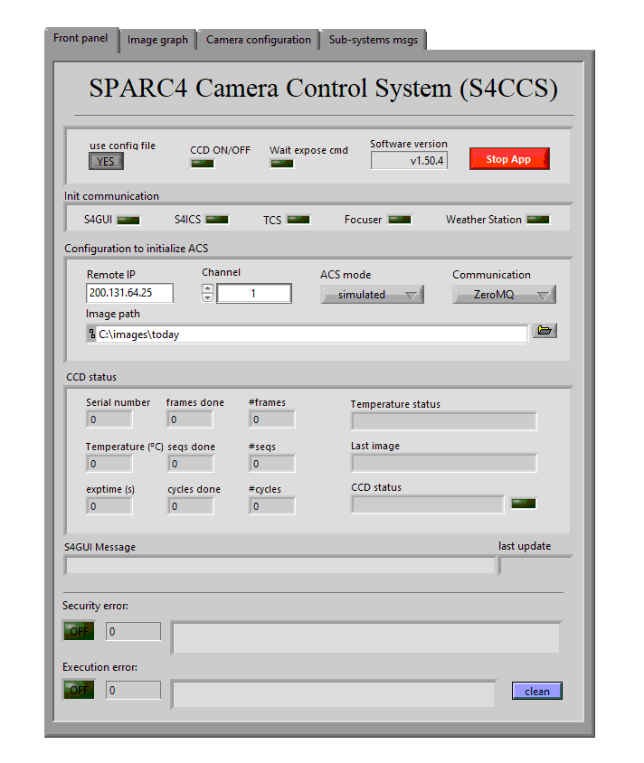

 
 
 [](https://github.com/Naereen/StrapDown.js/blob/master/LICENSE)
 [](https://zenodo.org/doi/10.5281/zenodo.12796063)

 # SPARC4 Camera Control System

The Simultaneous Polarimeter and Rapid Camera in Four Bands ([SPARC4](https://coast.lna.br/home/sparc4)) is a new astronomical instrument developed by *Instituto Nacional de Pesquisas Espaciais* (INPE), in collaboration with *Laboratório Nacional de Astrofísica* (LNA), that is currently installed on the Perkin-Elmer 1.6 m telescope of Picos dos Dias Observatory (in Portuguese, OPD). SPARC4 was developed to allow simultaneous photometric and polarimetric acquisitions in the g, r, i and, z bands of the Sloan Digital Sky Survey ([SDSS](https://www.sdss.org/)). The data acquisition is done using four Electron Multplying CCD cameras, one for each optical band of the instrument, produced by Oxford Instruments. The control of SPARC4 is done by a set of dedicated softwares. These softwares are the Camera Control System (S4CCS), the Instrument Control System, and the Graphical User Interface (S4GUI). S4CCs is responsible for controlling the scientific cameras of the instrument. S4ICS controls its moving mechanisms. S4GUI is an user interface the coordinates all the sub-systems of SPARC4.

For the development of S4CCS, the graphical programming language Laboratory Virtual Instrument Engineering Workbench (LabVIEW) 2018 was used together with the Software Development Kit (SDK) made available by the Oxford Instruments for the communication with the cameras. The data acquired by the cameras are saved in Flexible Image Transport System (FITS) files, created using python scripts. These scripts are run using an integrated library of LabVIEW for running Python interpreters. With the current version of S4CCS, it is possible to acquire a series of 1400 images of 1024 x 1024 pixels, with an overhead of 1.7 ms between images. Besides, it is possible to acquire several series of 1400 images, with an overhead of 120 ms between series. 
 
## Getting Started

These instructions will get you a copy of the .exe of S4CCS on your local machine for testing purposes. 

### Prerequisites

S4CCS uses a [Python 3.6 (32-bits)](https://www.python.org/downloads/release/python-368/) interpreter to run the scripts responsible for saving the FITS files. This is the most recent version of Python supported by LabVIEW 2018. It should be downloaded and installed on your local machine. After that, some python dependencies mustbe installed too. For that, run the following command:

```bash
pip install dataclasses astropy numpy pandas
```

### Installing S4CCS
1. Download and extract the S4CCS .zip file found in this [link](https://github.com/DBernardes/S4CCS/releases/latest). 
1. Inside the extracted folder, there is a file name `acs_config_TEMPLARE`.
This file has the configuration that S4CCS needs to run and it **must** be placed in the path `C:\Users\<user_name>\SPARC4\CCS\acs_config.cfg` (without the `_TEMPLATE` string).
1. Running the executable `CCS.exe`, an interface will show up. It should be similar to the image below. In this interface, set the `use config file` buttom in the most top panel to `NO`. This will set S4CCS to use the information present in the `Init configuration` panel to initialize.
1. Configure the `Init configuration` panel according to your local environment. Table presented in this [link](https://github.com/DBernardes/S4CCS#Description-of-the-inital-configuration-parameters) presents a description of inital configuration parameters.
1. After this configuration, you should be able to run the software by pressing the white arrow at the top of the window.

<p align="center"></p>


### Description of the inital configuration parameters

|Parameter|Description|
|----|-----|
|Remote IP| IP from where S4CCS will receive a query|
|Channel| The current channel of the instrument|
| CCS mode | The mode of S4CCS (real or simulated)
| Communication | The type of communication that should be used (TCP-IP or ZeroMQ)|
|IOmage path | The path where the acquired images should be saved|

## How to cite
If this work helped you in any way, please consider citing it.
Visit our Zenodo webpage on:

[](https://zenodo.org/doi/10.5281/zenodo.12796063)


## Authors and Contact

- **Denis Bernardes**
  - [Github](https://github.com/DBernardes)
  - [LinkedIn](www.linkedin.com/in/denisbernardes)
  - [Email](mailto:denis.bernardes099@gmail.com)
  - Affiliation: Instituto Nacional de Pesquisas Espaciais (INPE).
  - Address: 1758 Astronautas Avenue, Jardim da Granja, São José dos Campos, São Paulo, Brazil.

## License

This project is licensed under the MIT License - see the [LICENSE.md](LICENSE.md) file for details
